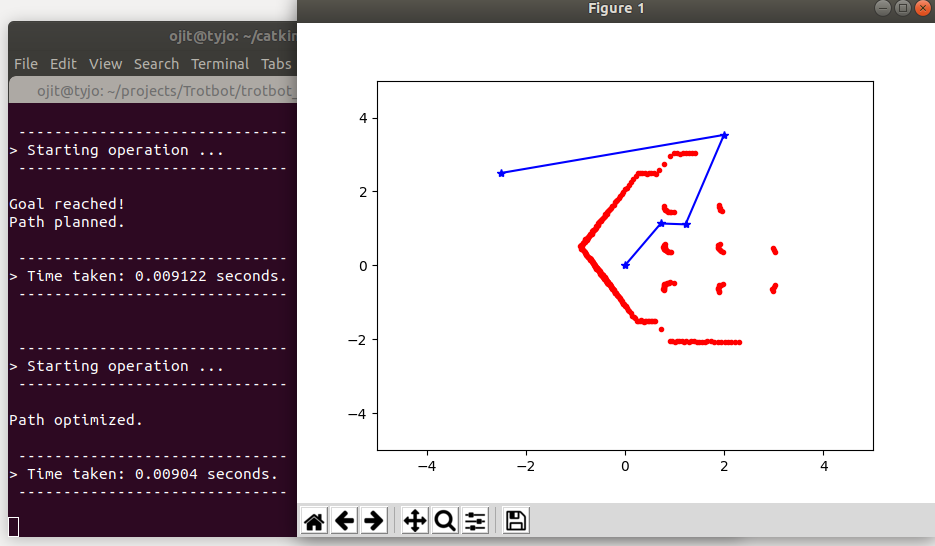

# Navigation Package

## Usage:

Meet the prequisites mentioned [here](https://github.com/ERC-BPGC/Trotbot).

To use this package run:
1) Obstacle Detector Node:
```
$ rosrun navigation obstacle_detector.py
```
* Subscribed Topics:
    - /scan (sensor_msgs/LaserScan)
* Published Topics:
    - /obstacles (navigation/PolygonArray)


2) Path Planner Service:
```
$ rosrun navigation path_planner.py
```
* Subscribed Topics:
    - 
* Published Topics:
    -


3) Dynamic Manager Action Client:
```
$ rosrun navigation dynamic_manager.py
```
* Subscribed Topics:
    - /scan (sensor_msgs/LaserScan)
* Published Topics:
    - /obstacles (navigation/PolygonArray)

4) Dynamic Manager Action Server:
```
$ rosrun navigation controller.py
```
* Subscribed Topics:
    - /scan (sensor_msgs/LaserScan)
* Published Topics:
    - /obstacles (navigation/PolygonArray)


## Hardware Used:
- RP-Lidar A1
    - The laserscan from RP-Lidar A1 is used for obstacle detection.
- Intel Realsense D435i
    - Realsense is used to get the odometry using [rovio](https://github.com/ethz-asl/rovio).


## Known Issues:

## Results:
Path Planning: `python ./scripts/rrt_for_scan/tests/rrt_test_scan.py`


