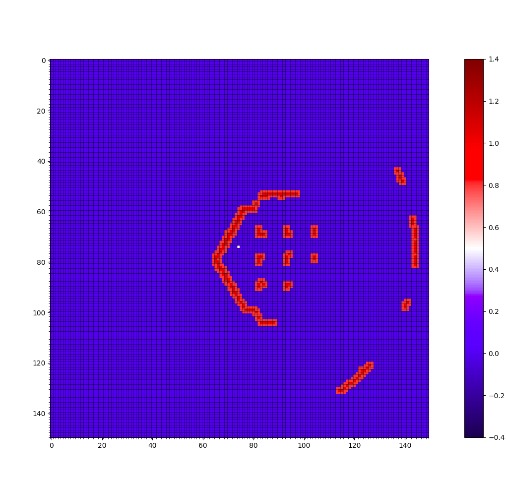

# Navigation Package

## Usage:

Meet the prequisites mentioned [here](https://github.com/ERC-BPGC/Trotbot).

To use this package run following nodes in different terminals:
1) Obstacle Detector Node:  
    a. Polygon Type
    ```
    $ rosrun navigation obstacle_detector.py
    ```
    * Subscribed Topics:
        - /scan (sensor_msgs/LaserScan)
    * Published Topics:
        - /obstacles (navigation/PolygonArray)
    
    b. Grid Type
    ```
    $ rosrun navigation lidar_to_grid.py
    ```
    * Subscribed Topics:
        - /scan (sensor_msgs/LaserScan)
    * Published Topics:
        - /gridmap (nav_msgs/OccupancyGrid)
    

<br />

2) Path Planner:
```
$ rosrun navigation path_planner.py
```
* Subscribed Topics:
    - /scan (sensor_msgs/LaserScan)
* Services:
    - /rrt_planning_service (navigation/Planner)
        - returns boolean

<br />

3) Dynamic Manager:
```
$ rosrun navigation dynamic_manager.py
```
* Subscribed Topics:
    - /obstacles (navigation/PolyArray)
    - /scan (sensor_msgs/LaserScan)
* Services(): 
    - /rrt_planner_service (navigation/Planner)
* Action Client:
    - /move_bot (navigation/MoveBot.action)

<br />

4) Controller:
```
$ rosrun navigation controller.py
```
* Subscribed Topics:
    - /odom (nav_msgs/Odometry)
* Published Topics:
    - /cmd_vel (geometry_msgs/Twist)
* Action Server:
    - /move_bot (navigation/MoveBot.action)


## Hardware Used:
- RP-Lidar A1
    - The laserscan from RP-Lidar A1 is used for obstacle detection.
- Intel Realsense D435i
    - Realsense is used to get the odometry using [rovio](https://github.com/ethz-asl/rovio).


## Known Issues:


## Results:
### 1) Obstacle detection

 

```
nosetests -s scripts/mapping/tests/lidar_to_grid_test.py
```

<!--  -->

### 2) Path Planning: RRT and RRT*

 

```
python2 scripts/rrt_for_scan/tests/rrt_test_scan.py
```


```
nosetests -s ./navigation/rrt_star/tests/rrt_star_scan_test.py
```

### 3) Grid Based: Dijkstra and A*


```
nosetests -s scripts/grid_based/tests/dijkstra.py
nosetests -s scripts/grid_based/tests/a_star_test.py
```


## References:
1.   Bloesch, M., Burri, M., Omari, S., Hutter, M., & Siegwart, R. (2017). Iterated extended Kalman filter based visual-inertial odometry using direct photometric feedback. The International Journal of Robotics Research, 36(10), 1053–1072. https://doi.org/10.1177/0278364917728574

2.   S. Karaman and E. Frazzoli. Incremental sampling-based algorithms for optimal motion planning. In Robotics: Science and Systems (RSS), Zaragoza, Spain, June 2010 https://arxiv.org/abs/1105.1186 
